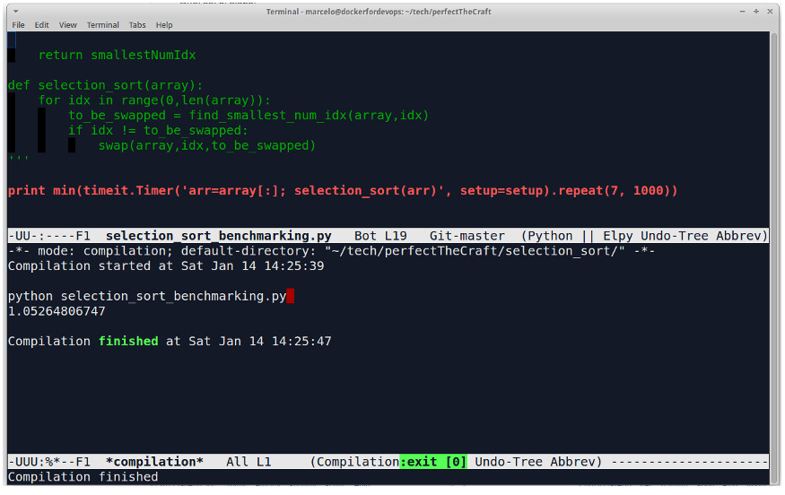

# Selection Sort

Very first algorithm (Selection Sort) and good practices to time the execution of the function

Brief set of steps:
* Find the smallest number
* Compare with i
* Swap when necessary

  *i is the current item that is being processed while we iterate through the array*

--

What did we learn here?

1. Try to break down a big problem into smaller problems - Instead of getting yourself overwhelmed with nested loops, sometimes you might want to try a separate function (e.g., find_smallest_num_idx).

2. The timeit module is pretty cool.
  * The repeat() function will run the setup again for each repetition and then execute the selection_sort() function 1000 times on each of these 7 repetitions. Then we get the “min” result (the best running time).


# Output:

7 repetitions of 1000 executions (7 different arrays randomly defined):

```python
print min(timeit.Timer('arr=array[:]; selection_sort(arr)', setup=setup).repeat(7, 1000))
python selection_sort.py
1.92810797691
```

# Emacs:
* 
